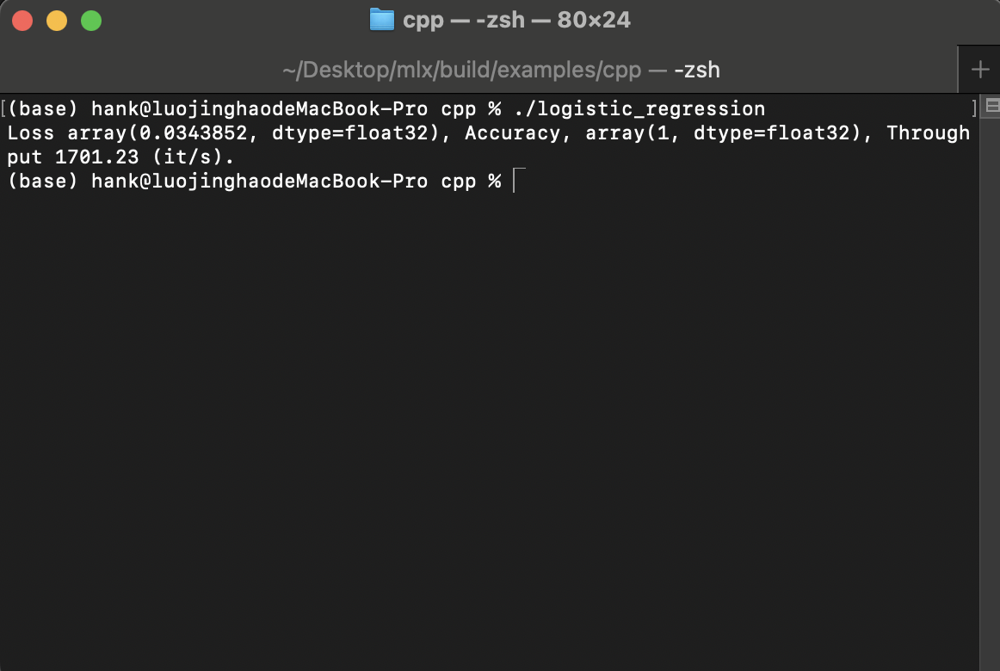
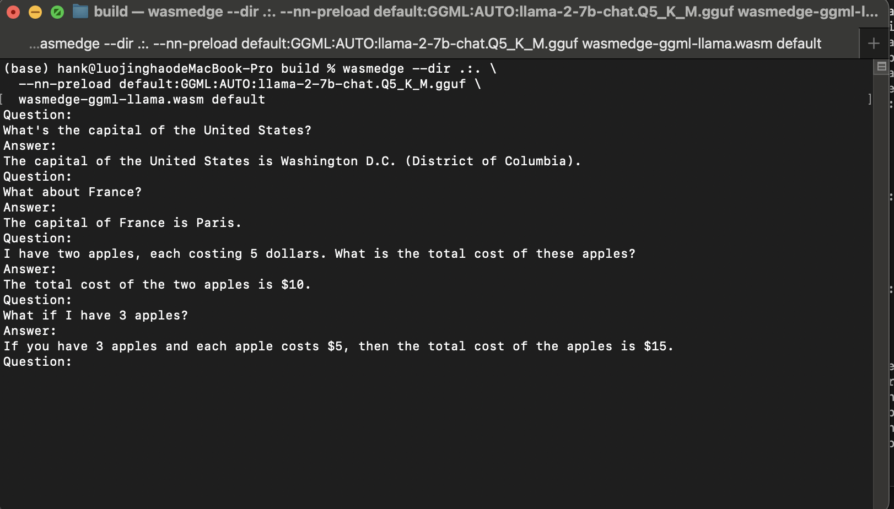
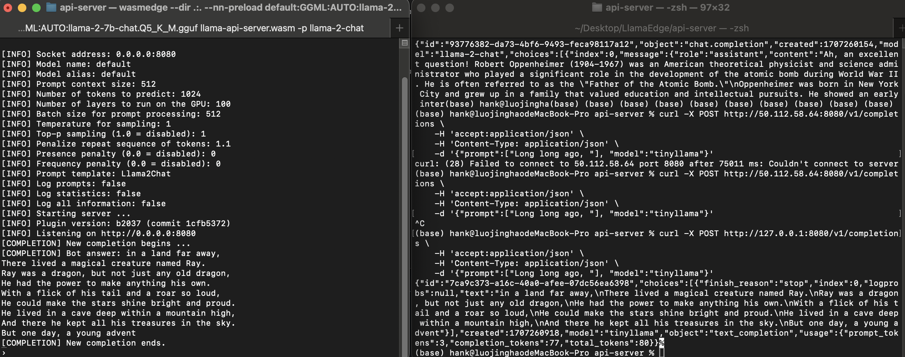
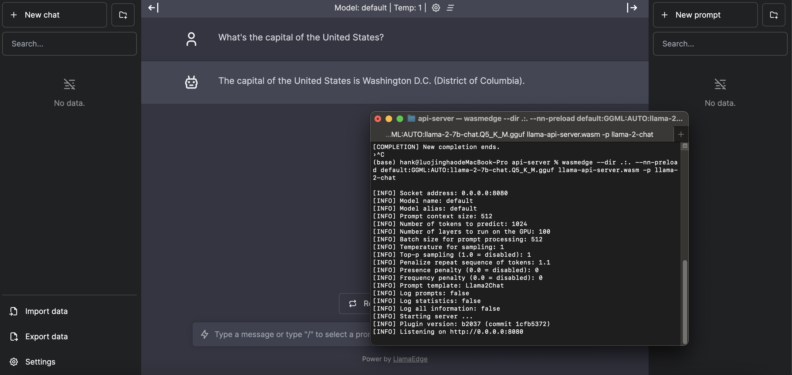

# LFX-Mentorship-Pre-test


## System Information

```bash
Hardware: Apple M1 Arm64, 8GB RAM
Operating System: macOS Sonoma 14.3
Kernel Version: Darwin 23.3.0

CMake Version: 3.28.2
Clang Version: 17.0.6
Homebrew 4.2.7
```

## Build MLX

```bash
git clone git@github.com:ml-explore/mlx.git mlx && cd mlx
mkdir -p build && cd build
cmake .. && make -j
make install
```



## Build WasmEdge
```bash
git clone https://github.com/WasmEdge/WasmEdge.git
git checkout hydai/0.13.5_ggml_lts
mkdir build

cmake -GNinja -Bbuild -DCMAKE_BUILD_TYPE=Release \
  -DWASMEDGE_PLUGIN_WASI_NN_BACKEND="GGML" \
  -DWASMEDGE_PLUGIN_WASI_NN_GGML_LLAMA_METAL=ON \
  -DWASMEDGE_PLUGIN_WASI_NN_GGML_LLAMA_BLAS=OFF \
  .

cmake --build build
cmake --install build
```

## Example

### Build proces
  
1. Change `n-gpu-layers` to 35
2. Run `cargo build --target wasm32-wasi --release`
3. Download model [llama-2-7b-chat.Q5_K_M.gguf](https://huggingface.co/TheBloke/Llama-2-7B-Chat-GGUF/blob/main/llama-2-7b-chat.Q5_K_M.gguf)

### LLama Chat



### API Server


### Web UI


## Troubleshooting

1. `simdjson` not found

    This error occurs when `simdjson` is already installed on the system. `find_package` can find the `simdjson` package, but the `target_link_libraries` command is not able to link the `simdjson` library. To resolve this issue, change `simdjson` to `simdjson::simdjson` in `plugins/wasi_nn/CMakeLists.txt`

2. Segmentation fault because `ggml-metal.metal` not found:

    This error occurs when building WasmEdge as a shared library, due to Llama placing the `ggml-metal.metal` file in the `bin` directory, while it actually searches for this file in the `lib` directory—where the shared library is located. To quickly resolve this issue, add the following code snippet to `wasmedge/plugins/wasi-nn/CMakeLists.txt`, which can ensure the `ggml-metal.metal` file is copied to the `lib` directory, matching the expected file location

    ```cmake
    if(WASMEDGE_PLUGIN_WASI_NN_GGML_LLAMA_METAL)
        install(FILES ${CMAKE_BINARY_DIR}/_deps/llama-src/ggml-metal.metal DESTINATION ${CMAKE_INSTALL_LIBDIR}/wasmedge)
    endif()
    ```